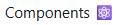

# Re-Counter 

An incremental counter with state tracking using Redux Toolkit.

## Motivation: 
To use Redux Chrome Extension within dev tools to track the state of a counter, review logs, and roll back when needed. To setup a redux store, provided access to from any file using Provider api, create a reducer of multiple incremental actions, and use UseSelector and useDispatch hooks to obtain current state and update it from a component.

## Quick start:
1. Clone branch  
2. If not already installed:  
`npm install @reduxjs/toolkit react-redux redux`  
Search [chrome.google.com/webstore](chrome.google.com/webstore) to add Redux Devtools  
3. `npm install`  
`npm run dev`
4. Open devtool and locate the tab:   